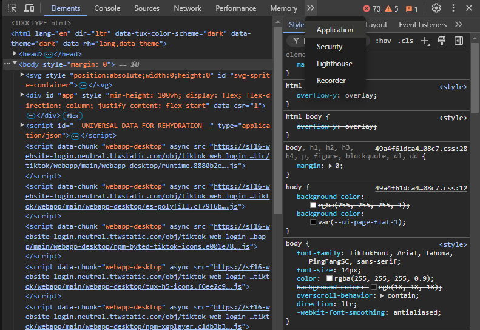
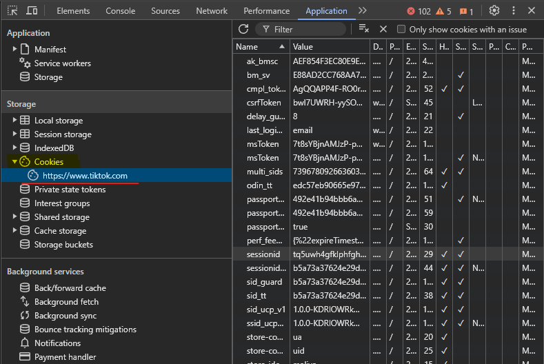
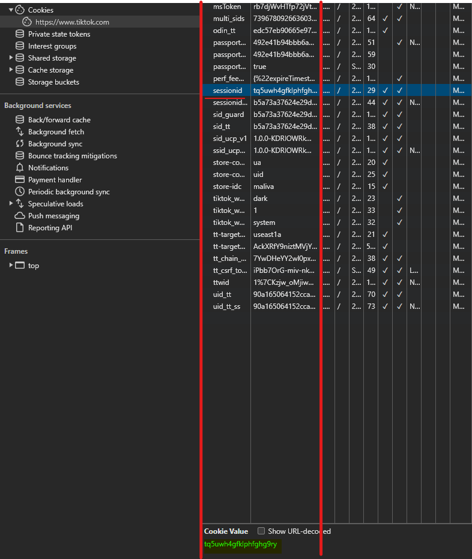
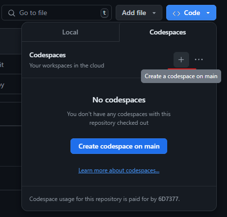
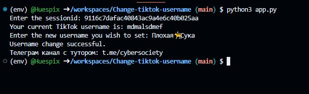

# Інструкції для користувача

## Крок 1: Використання Google Chrome для доступу до профілю TikTok

1. **Відкрийте браузер Google Chrome.**

   Якщо у вас ще не встановлено Google Chrome, завантажте та встановіть його з офіційного сайту [Google Chrome](https://www.google.com/chrome/).

2. **Увійдіть до свого профілю TikTok.**

   - Перейдіть на [сайт TikTok](https://www.tiktok.com/).
   - У верхньому правому куті натисніть на **"Увійти"**.
   - Введіть ваші дані для входу, щоб увійти в свій профіль.


3. **Відкрийте інструменти розробника:**

   - Натисніть клавішу **F12** на вашій клавіатурі. Це відкриє панель інструментів розробника в Google Chrome.

4. **Перейдіть до вкладки **Application**:**

   - В панелі інструментів розробника натисніть на дві стрілочки з права, щоб знайти додаткові вкладки. Коли ви наведіть курсор на ці стрілочки, повинно з’явитися повідомлення **"More Tabs"** (Більше вкладок).
   - У списку вкладок знайдіть і натисніть на вкладку **Application**.

   

5. **Знайдіть вкладку **Cookies**:**

   - У вкладці **Application** знайдіть підменю **Cookies**. Воно може бути представлене зображенням печива 🍪.
   - Натисніть на **Cookies**, щоб побачити список всіх доступних кукі-файлів.

   

6. **Знайдіть пункт **sessionid**:**

   - У нижній частині панелі з'явиться список з різними кукі-файлами. Знайдіть пункт з назвою **sessionid**.
   - Клацніть на нього, щоб переглянути деталі.

   

7. **Збережіть значення sessionid:**

   - У нижній частині сторінки ви побачите набір букв і цифр, подібний до `tq5uwh4gfklphfghg9ry`.
   - Збережіть це значення, щоб не загубити його. Це значення потрібно для подальших кроків.

## Крок 2: Створення GitHub акаунту та налаштування Codespace

1. **Створіть GitHub акаунт:**

   - Перейдіть на [GitHub](https://github.com/).
   - Натисніть на **"Sign up"** (Реєстрація) і дотримуйтесь інструкцій для створення нового акаунту.

2. **Перейдіть до репозиторію:** [перейти](https://github.com/6D7377/tiktok-username-changer/tree/main)

   - Відкрийте репозиторій за наданим посиланням. Це може бути посиланням на GitHub репозиторій, який ви отримали.
   - Якщо ви це читаєте, то ви уже в ньому, можете не переходити.

3. **Створіть Codespace:**

   - В репозиторії натисніть кнопку **<> Code**.
   - У меню, що з'явиться, виберіть вкладку **Codespaces**.
   - Натисніть кнопку **+** (Створити) для створення нового Codespace.

   

## Крок 3: Запуск програми в Codespace

1. **Коли ваш Codespace прогрузиться, відкрийте консоль.**

2. **Введіть наступні команди в консоль:**

   ```bash
   clear && python3 -m venv env && source env/bin/activate
   pip install requests && clear
   python3 app.py
## Крок 4: Кінцевий результат, який ми отримали:


## Кому цікава така тематика підпишіться на мій [телеграм канал](https://t.me/ExploitSociety) і поставте зірочку репозиторію.
